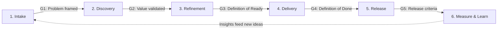

# Operating Model: Idea → Value

Work moves through six stages. Each stage ends in a **quality gate**: a short, checkable list that must pass before work moves on. The gates are what make this efficient. Rework is caught where it is cheapest.

## Cost of a defect by stage

| Found at | Relative cost to fix | Typical cause |
|---|---|---|
| Refinement | 1x | Ambiguous acceptance criteria |
| Development | 5x | Missed edge case or dependency |
| QA / UAT | 10x | Requirement misunderstood |
| Production | 30x+ | No one owned the non-functional requirement |

*The ratios are illustrative and consistent with long-standing industry findings. The point is direction, not precision.*

---

## Stage 1: Intake

**Purpose:** Capture every request in one place, in one format.

- A single intake channel (form or issue template), not email or DMs
- Required: requester, problem statement, who is affected, business impact, urgency

**Gate G1: Problem framed**
- [ ] Problem is stated without prescribing a solution
- [ ] Affected users or roles are named
- [ ] Impact is quantified, or marked "unknown" with a plan to find out

**Automate:** intake form → auto-created backlog item → auto-label by source → weekly triage digest.

## Stage 2: Discovery

**Purpose:** Decide whether it is worth building before deciding how.

- Check fit against the [product vision board](../templates/product-vision-board.md) and [roadmap](../templates/roadmap.md)
- Stakeholder interviews ([stakeholder map](../templates/stakeholder-map.md)), [personas](../templates/persona.md), process mapping, data pull
- Score the opportunity with WSJF or RICE
- Write the PRD for anything larger than a single story ([template](../templates/prd.md))

**Gate G2: Value validated**
- [ ] Success metric defined, with a baseline and a target
- [ ] Prioritization score recorded
- [ ] Linked to a PI objective or OKR
- [ ] Key decision logged ([template](../templates/decision-log.md))

## Stage 3: Refinement

**Purpose:** Turn validated value into small, testable, independent stories.

- For epics, build a [story map](../templates/story-map.md) and define the walking skeleton first
- Run refinement per the [ceremony playbook](../templates/ceremonies.md)
- Split using INVEST, and by workflow step, business rule, data variation, or interface
- Acceptance criteria in Given / When / Then
- Three Amigos review (PO + Dev + QA) for anything with rules or edge cases

**Gate G3: [Definition of Ready](../templates/definition-of-ready.md)**
*Automated:* `story_lint.py` checks structure; the GitHub Action runs it on every new story.

## Stage 4: Delivery

**Purpose:** Build it right, with fast feedback.

- WIP limits per column
- PO available daily for clarification, with same-day answers as the target
- Demo each story to the PO when it's done, not at the end of the sprint

**Gate G4: [Definition of Done](../templates/definition-of-done.md)**
*Automated:* the PR template checklist, CI tests, and linking to the story.

## Stage 5: Release

**Purpose:** Ship safely and tell people what changed.

- UAT with a requirement → test → sign-off trail ([UAT plan & traceability](../templates/uat-and-traceability.md))
- Release notes generated from merged stories ([template](../templates/release-notes.md))
- Rollback plan for anything touching money, compliance, or customer data
- Stakeholder sign-off captured where regulation requires it

**Gate G5: Release criteria**
- [ ] All stories meet DoD
- [ ] No open Sev-1 or Sev-2 defects
- [ ] Release notes approved
- [ ] Support or operations briefed

## Stage 6: Measure & Learn

**Purpose:** Close the loop: did it deliver the outcome?

- Compare the success metric against baseline 2–6 weeks after release
- Review [flow and quality metrics](metrics.md) each sprint in the retro
- Feed learnings back into intake as new items or backlog changes

---

## Roles (RACI, abbreviated)

| Activity | PO | BSA | Dev | QA | Stakeholder |
|---|---|---|---|---|---|
| Intake triage | A | R | I | I | C |
| PRD / discovery | A | R | C | C | C |
| Story writing | A | R | C | C | I |
| Acceptance | A/R | C | I | C | C |
| Release sign-off | A | C | C | R | C |

*R = Responsible, A = Accountable, C = Consulted, I = Informed. In smaller teams, the PO and BSA are the same person.*
