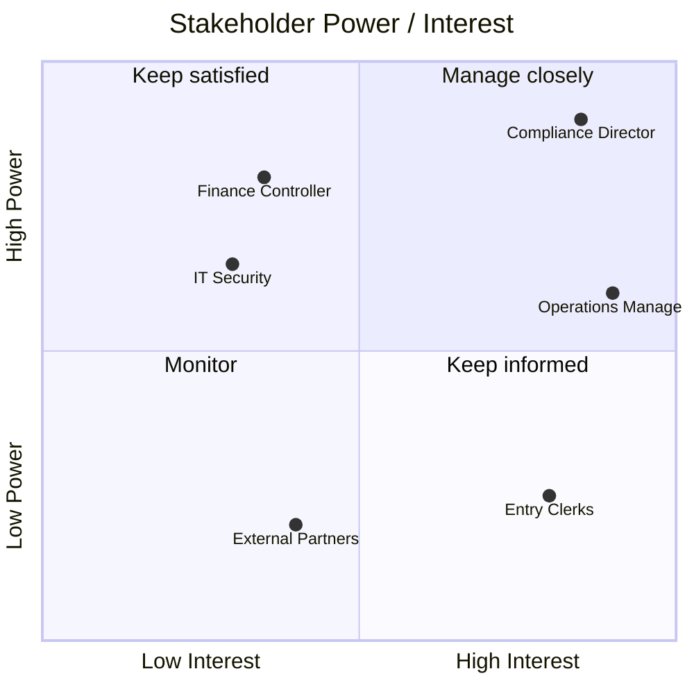

# Stakeholder Map & Communication Plan: [Product / Initiative]

**Owner:** [PO] · **Updated:** YYYY-MM-DD

## 1. Power / Interest grid



*Example placements. Replace them with your own stakeholders, then re-plot every PI, because people move between quadrants.*

| Quadrant | Strategy |
|---|---|
| **Manage closely** (high power, high interest) | Co-create. Involve them in discovery and prioritization, and hold regular 1:1s. |
| **Keep satisfied** (high power, low interest) | Send concise updates about outcomes and risks only. Never surprise them. |
| **Keep informed** (low power, high interest) | Demos, release notes, feedback channels. These are often your best source of insight. |
| **Monitor** (low power, low interest) | Periodic broadcast. Watch for changes in their position. |

## 2. Stakeholder register

| Stakeholder | Role / team | Quadrant | What they care about | Current stance | Desired stance | Owner |
|---|---|---|---|---|---|---|
| | | | | Resistant · Neutral · Supportive · Champion | | |

## 3. Communication plan

| Audience | What they need | Format | Frequency | Owner | Feedback loop |
|---|---|---|---|---|---|
| Executive sponsor | Outcome progress, risks, decisions needed | 1-page status or 15-minute sync | Bi-weekly | PO | Decisions logged in `decision-log.md` |
| Steering group | Roadmap changes, PI objectives, budget | Roadmap review | Per PI | PO | Change log in `roadmap.md` |
| Business SMEs | Upcoming changes, requirement validation | Refinement invites, prototypes | Per sprint | PO / BSA | Comments on stories |
| End users | What's new, how to use it | Release notes, short video, training | Per release | PO | Feedback form / survey |
| Delivery team | Priorities, context, the "why" | Refinement, planning, backlog | Continuous | PO | Retro |
| Support / Ops | What's changing, runbooks, known issues | Release briefing | Per release | PO / Tech lead | Incident review |

## 4. Status update template (1 page)

```
[Initiative] Status: YYYY-MM-DD           Overall: 🟢 / 🟡 / 🔴

Outcome progress:   [metric] baseline → current → target
Delivered since last update:  • …
Next two weeks:               • …
Risks / blockers (with ask):  • … → need decision from [name] by [date]
Decisions made:               • DEC-0xx …
```

## 5. Handling conflicting priorities

1. Bring stakeholders back to the **shared objective**, not to individual requests.
2. Make the trade-off visible with the same scoring for everyone, such as WSJF or RICE.
3. Log the decision and its rationale (`decision-log.md`).
4. Escalate with options, not problems: "Option A delivers X by June. Option B delivers Y by May. I recommend A because…"
